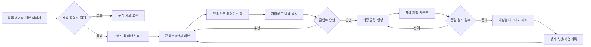

# 판매 제품 브랜딩을 위한 영상 생성 AI 워크플로우

> 문서 버전: 1.0  
> 작성일: 2026-08-30  
> 적용 범위: Shopify에서 판매할 제품의 상품 상세 영상, 광고용 숏폼, SNS 유기적 콘텐츠  
> 운영 원칙: AI는 제품을 재해석할 수 있지만 제품의 사실을 바꾸면 안 된다.

## 1. 목적

이 문서는 도매·소싱 상품을 단순 등록하는 데서 그치지 않고, 일관된 브랜드 경험을 가진 영상 자산으로 전환하기 위한 반복 가능한 제작 절차를 정의한다.

목표는 다음과 같다.

1. 상품마다 달라지는 기획·프롬프트·검수 방식을 표준화한다.
2. 원본 상품의 형태, 색상, 로고, 구성품과 판매 조건이 왜곡되는 위험을 줄인다.
3. 하나의 마스터 기획으로 Shopify 상품 페이지와 세로형 숏폼을 함께 생산한다.
4. 성과 데이터를 다음 제작에 반영하여 브랜드의 영상 문법을 축적한다.

이 문서에서 말하는 브랜딩은 로고를 영상에 붙이는 작업만을 뜻하지 않는다. 반복되는 메시지, 색, 조명, 카메라 움직임, 자막 어조, 사운드와 제품을 보여주는 순서를 하나의 시스템으로 관리하는 것을 뜻한다.

## 2. 권장 운영 모델

### 2.1 핵심 전략

- **제품 사실은 원본 데이터에서 잠근다.** 제품명, 규격, 소재, 색상, 구성품, 사용법과 가격 조건은 AI가 만들지 않는다.
- **AI 생성은 짧은 샷 단위로 한다.** 긴 영상을 한 번에 생성하기보다 2~6초 단위 클립을 만들고 편집 단계에서 조립한다.
- **제품 중심 샷은 이미지→영상 방식을 우선한다.** 텍스트만으로 제품을 다시 만들면 외형이 달라질 가능성이 커진다.
- **브랜드 자산과 성과 자산을 분리한다.** 로고, 색, 폰트, 엔드카드는 고정하고 훅, 카피, 샷 순서는 실험한다.
- **공개 전 사람이 승인한다.** 제품 충실도, 표현·권리, 채널 규격은 자동 생성 결과만 믿지 않고 담당자가 확인한다.

### 2.2 전체 흐름



## 3. 역할과 승인 책임

소규모 팀에서는 한 사람이 여러 역할을 맡아도 되지만, 승인 책임은 구분한다.

| 역할 | 주요 책임 | 최종 승인 항목 |
|---|---|---|
| 상품 담당 | 원본 정보와 판매 가능 상태 제공 | 규격, 소재, 구성품, 재고·가격 표현 |
| 브랜드 담당 | 타깃, 포지셔닝, 톤앤매너 정의 | 메시지, 비주얼, 카피 |
| AI 크리에이터 | 콘셉트, 프롬프트, 클립 생성 | 생성 로그, 버전 관리 |
| 편집 담당 | 컷 편집, 자막, 사운드, 색보정 | 채널별 마스터 파일 |
| QA/퍼블리셔 | 사실·권리·규격 검수와 게시 | 공개 여부, 게시 메타데이터 |

한 사람이 전 과정을 수행할 때도 `제작 완료`와 `게시 승인`을 별도 체크로 남긴다.

## 4. 제작 시작 조건

### 4.1 필수 입력 자료

현재 저장소의 `contracts/product.schema.json`을 기준으로 아래 데이터를 제작 브리프에 재사용한다.

| 입력값 | 저장소 필드 | 영상 제작에서의 사용 |
|---|---|---|
| 상품 식별자 | `source.site`, `source.sourceId` | 프로젝트명, 중복 방지, 이력 추적 |
| 상품명 | `title` | 화면 카피, 파일명, 게시 제목의 초안 |
| 브랜드 | `brand` | 브랜드 표기와 톤 선택 |
| 상품 설명 | `descriptionHtml` | 특징 후보 추출. 원문 그대로 광고 주장에 사용하지 않음 |
| 카테고리 | `sourceCategory` | 타깃과 사용 장면 가설 |
| 옵션 | `options`, `variants.optionValues` | 영상에 등장한 옵션과 판매 옵션 일치 확인 |
| 이미지 | `images`, `role` | 제품 레퍼런스 팩 구성 |
| 재고 | `variants.stock` | 품절 상품 제작·게시 방지. `null`과 `0`을 구분 |
| 경고 | `warnings` | 누락·불확실 정보가 있으면 자동 공개 금지 |

스키마에 없는 아래 자료는 사람이 보완한다.

- 실제 제품 샘플 또는 판매 권한이 확인된 고해상도 이미지
- 정확한 치수, 소재, 구성품, 사용 제한, 인증 정보
- 로고 원본, 브랜드 컬러, 사용 폰트, 금지 표현
- 핵심 고객과 해결하려는 상황
- 사용 권한이 확인된 음악, 음성, 모델·인물 자료
- 캠페인 목표와 CTA

### 4.2 제작 적합성 게이트

아래 항목 중 하나라도 충족하지 않으면 제품 중심 AI 영상을 공개하지 않는다.

- [ ] 메인 제품 이미지가 선명하고 제품 전체가 보인다.
- [ ] 전·후·측면 또는 디테일을 확인할 수 있는 이미지가 3장 이상 있다.
- [ ] 영상에서 보여줄 색상과 실제 판매 옵션이 일치한다.
- [ ] 소재, 기능, 크기와 구성품을 확인할 근거가 있다.
- [ ] 공급처 이미지와 로고의 2차 사용·편집 권한을 확인했다.
- [ ] `warnings`에 공개를 막는 미확인 사항이 없다.
- [ ] 재고가 `0`이 아니며 판매 예정 상태가 확인됐다.

실물 또는 충분한 레퍼런스가 없다면 제품을 정확히 보여주는 광고 대신, 추상적 무드 영상이나 콘셉트 보드까지만 제작한다.

## 5. 표준 제작 워크플로우

### 단계 0. 작업 ID와 폴더 생성

작업 ID는 아래 규칙을 권장한다.

```text
<site>-<sourceId>_<campaign>_<YYYYMMDD>
```

자산 폴더 예시:

```text
creative/video/<작업ID>/
  00_brief/
  01_reference/
  02_script-shotlist/
  03_generation/
    prompts/
    selects/
    rejects/
  04_edit/
  05_exports/
  06_qa/
  manifest.json
```

`rejects`도 일정 기간 보관한다. 어떤 프롬프트가 제품 변형을 일으켰는지 다음 제작에서 피할 수 있기 때문이다.

### 단계 1. 브랜드·캠페인 브리프 작성

브리프는 한 페이지 안에서 아래 질문에 답해야 한다.

```yaml
product_id: "<site>:<sourceId>"
product_name: ""
campaign_goal: "인지 | 상세페이지 이해 | 장바구니 | 재방문"
audience: "누가, 어떤 상황에서 이 제품을 필요로 하는가"
single_message: "영상 하나가 전달할 단 하나의 문장"
proof_points:
  - "확인 가능한 제품 근거 1"
  - "확인 가능한 제품 근거 2"
brand_personality: "예: 차분한, 실용적인, 정직한"
visual_keywords: ["키워드1", "키워드2", "키워드3"]
must_show: ["실제 제품", "핵심 디테일", "사용 결과"]
must_not_show: ["미판매 옵션", "확인되지 않은 성능", "타사 로고"]
cta: ""
channels: ["shopify", "instagram_reels", "tiktok", "youtube_shorts"]
```

`single_message`는 여러 장점을 나열하지 않고 하나만 선택한다. 다른 장점은 별도 영상 변형으로 만든다.

### 단계 2. 콘텐츠 콘셉트 3안 설계

같은 제품에 대해 다음 3가지 축을 기본으로 기획한다.

1. **문제→해결형**: 고객의 불편을 먼저 보여주고 제품 사용으로 해결한다.
2. **제품 증명형**: 형태, 소재, 작동, 수납, 크기 등 실제로 확인 가능한 디테일을 보여준다.
3. **라이프스타일형**: 타깃 고객의 일상과 브랜드 감정을 중심으로 제품의 자리를 만든다.

각 콘셉트는 다음 4개 블록으로 작성한다.

| 블록 | 역할 | 권장 내용 |
|---|---|---|
| Hook | 시선을 멈춤 | 문제 장면, 뜻밖의 움직임, 결과 선공개 |
| Proof | 제품을 믿게 함 | 실제 기능·디테일·사용 맥락 |
| Brand | 기억을 남김 | 고정 색, 조명, 카피 어조, 사운드 모티프 |
| CTA | 다음 행동 유도 | 자세히 보기, 옵션 확인, 장바구니 등 한 가지 행동 |

콘셉트 승인 기준은 “멋있어 보이는가”가 아니라 “한 문장으로 설명 가능하고, 제품 근거가 있으며, 다른 두 안과 학습 가치가 다른가”이다.

### 단계 3. 대본과 샷 리스트 작성

15초 세로형 마스터의 기본 예시는 다음과 같다. 길이는 채널과 메시지에 맞게 조정한다.

| 시간 | 화면 | 목적 | 생성 방식 |
|---|---|---|---|
| 0~2초 | 문제 또는 결과를 강하게 제시 | Hook | 실사 또는 AI 보조 |
| 2~5초 | 제품 전체와 브랜드 실루엣 | 인지 | 제품 이미지→영상 |
| 5~9초 | 핵심 기능·디테일 1~2개 | Proof | 매크로 제품 샷 또는 실사 |
| 9~12초 | 실제 사용 맥락 | 욕구 형성 | 실사+AI 배경 또는 이미지→영상 |
| 12~15초 | 제품명, 핵심 문장, CTA | 기억·행동 | 고정 그래픽 템플릿 |

샷 리스트에는 최소한 아래 필드를 둔다.

```text
shot_id | duration | subject | action | environment | camera | lighting
reference | on_screen_text | audio | generation_method | acceptance_criteria
```

한 샷에 여러 움직임을 넣지 않는다. `카메라는 천천히 전진`, `제품은 정지`, `배경 빛만 움직임`처럼 주체별 동작을 분리한다.

### 단계 4. 레퍼런스 팩 제작

제품 일관성은 프롬프트보다 입력 이미지 품질에 더 크게 좌우될 수 있으므로 레퍼런스 팩을 먼저 고정한다.

필수 구성:

- `product_front`: 정면, 중립 배경, 고른 조명
- `product_3q`: 3/4 각도, 전체 비율 확인용
- `product_side_back`: 측·후면 구조 확인용
- `product_detail_*`: 로고, 버튼, 재질, 마감, 패턴
- `scale_reference`: 손 또는 알려진 크기의 물체와 함께 촬영
- `color_reference`: 실제 색상에 가까운 기준 이미지
- `brand_moodboard`: 색, 조명, 공간, 구도 예시
- `endcard`: 사람이 제작한 정확한 로고·제품명·CTA 그래픽

준비 규칙:

- 이미지에서 불필요한 워터마크와 타사 정보는 권한 범위 안에서 정리한다.
- 제품의 비율을 바꾸는 과도한 누끼·원근 보정은 피한다.
- AI에게 로고와 작은 글자를 새로 그리게 하지 않는다.
- 텍스트가 중요한 패키지는 원본을 별도 그래픽 레이어로 합성한다.

### 단계 5. 탐색 생성

탐색 단계에서는 최종 품질보다 방향을 빠르게 비교한다.

1. 콘셉트마다 대표 키프레임 2~4개를 만든다.
2. 승인된 키프레임만 짧은 모션 테스트로 변환한다.
3. 카메라 움직임, 제품 움직임, 배경 움직임을 한 번에 하나씩 바꾼다.
4. 결과마다 모델, 설정, 입력 이미지, 프롬프트와 생성 시간을 기록한다.
5. 제품 외형이 틀린 결과는 아름다워도 폐기한다.

탐색 종료 조건:

- [ ] 제품 실루엣과 주요 구조가 레퍼런스와 일치한다.
- [ ] 브랜드 무드가 브리프의 키워드로 설명된다.
- [ ] 첫 장면만 봐도 콘텐츠 축이 구분된다.
- [ ] 최종 생성에 사용할 프롬프트와 기준 프레임이 확정됐다.

### 단계 6. 최종 클립 생성

샷의 위험도에 따라 생성 방식을 선택한다.

| 샷 유형 | 권장 방식 | 이유 |
|---|---|---|
| 제품 히어로·회전·매크로 | 실제 제품 이미지→영상 | 외형 보존이 가장 중요 |
| 사용법·성능 증명 | 실사 촬영 우선, AI는 배경·보조 컷 | 허위 동작과 물리 오류 방지 |
| 라이프스타일·분위기 | 이미지→영상 또는 텍스트→영상 | 공간과 감정 탐색에 유리 |
| 추상 전환·텍스처 | 텍스트→영상 | 제품 사실과 충돌할 위험이 낮음 |
| 로고·가격·CTA | 편집 프로그램에서 직접 제작 | 글자·가격 정확성 확보 |

최종 생성은 샷별로 3~6개 변형을 만들고, 가장 좋은 결과를 선택한다. 동일한 프롬프트를 무제한 반복하기보다 실패 원인을 `형태`, `색`, `로고`, `물리`, `카메라`, `배경`으로 분류한 뒤 한 변수씩 수정한다.

### 단계 7. 편집, 자막, 사운드

편집 단계에서 브랜드 일관성을 완성한다.

- 첫 프레임에서 제품 또는 고객 상황이 즉시 식별되도록 한다.
- 자막 없이도 의미가 통하고, 음소거 상태에서도 핵심 메시지를 읽을 수 있게 한다.
- 자막은 한 화면에 한 메시지만 두고 UI가 겹치는 화면 가장자리를 피한다.
- 로고는 AI 생성 영상에 포함시키지 않고 검증된 원본 파일로 합성한다.
- 음성은 주장과 실제 기능이 일치하는지 대본 기준으로 다시 검수한다.
- 음악과 효과음은 상업적 사용 범위와 게시 채널 범위를 기록한다.
- AI 클립과 실사 클립의 색온도, 명암, 필름 그레인을 맞춰 이질감을 줄인다.
- 엔드카드는 제품명, 한 줄 가치, CTA를 고정 템플릿으로 운용한다.

### 단계 8. QA와 게시 승인

#### A. 제품 충실도

- [ ] 제품의 형태, 비율, 색, 재질이 원본과 일치한다.
- [ ] 로고, 라벨, 버튼, 포트, 무늬와 봉제선이 임의로 바뀌지 않았다.
- [ ] 영상에 나온 옵션과 실제 구매 가능한 옵션이 일치한다.
- [ ] 구성품이 추가되거나 빠지지 않았다.
- [ ] 사용 동작과 물리적 결과가 현실적이다.

#### B. 카피와 법적 위험

- [ ] 수치, 비교, 효능, 인증, 원산지 표현에 근거가 있다.
- [ ] “최고”, “완벽”, “100%” 같은 절대 표현을 근거 없이 쓰지 않았다.
- [ ] 건강·안전·환경 관련 주장을 담당자가 별도 확인했다.
- [ ] 음악, 폰트, 이미지, 인물, 음성의 상업적 사용 권한이 있다.
- [ ] 타사 상표, 워터마크, 개인정보가 노출되지 않는다.
- [ ] 필요한 경우 AI 생성·합성 사실 표시 기준을 확인했다.

#### C. 브랜드·영상 품질

- [ ] 한 영상이 하나의 핵심 메시지만 전달한다.
- [ ] 브랜드 컬러, 폰트, 로고 여백, 자막 어조가 가이드와 일치한다.
- [ ] 손가락, 반사, 그림자, 액체, 패키지 글자 등 생성 오류가 없다.
- [ ] 프레임 사이 제품이 순간적으로 변형되거나 깜빡이지 않는다.
- [ ] 모바일 화면에서 제품과 자막이 충분히 크다.
- [ ] 음소거와 소리 켠 상태 모두에서 이해된다.

#### D. 기술 규격

- [ ] 해상도, 화면비, 길이와 파일 형식이 게시 채널 기준에 맞는다.
- [ ] 영상·음성 싱크, 프레임 드롭, 검은 프레임이 없다.
- [ ] 썸네일과 첫 프레임이 제품을 정확히 보여준다.
- [ ] 압축 후 작은 글자와 제품 디테일이 무너지지 않는다.

제품 충실도 또는 권리 항목에서 하나라도 실패하면 공개하지 않는다.

### 단계 9. 채널별 내보내기와 게시

하나의 편집 타임라인에서 다음 마스터를 만든다.

| 산출물 | 기본 화면비 | 내부 권장 길이 | 용도 |
|---|---:|---:|---|
| 세로형 마스터 | 9:16 | 10~20초 | Reels, TikTok, Shorts |
| 상품 상세 마스터 | 1:1 또는 4:5 | 10~30초 | Shopify 상품 미디어 |
| 가로형 파생본 | 16:9 | 메시지에 따라 조정 | YouTube, 랜딩 페이지, 광고 |
| 무자막 클린본 | 원본과 동일 | 원본과 동일 | 번역·재편집 |
| 썸네일 | 채널별 규격 | 정지 이미지 | 상품·콘텐츠 대표 이미지 |

위 길이는 제작 효율을 위한 내부 기본값이며 플랫폼의 최대 허용 길이를 뜻하지 않는다. 2026-08-30 확인 기준으로 Shopify는 업로드 영상에 대해 최대 10분, 1GB, 4K와 `.mp4`·`.mov`·`.webm` 형식을 안내한다. YouTube는 정사각형 또는 세로형 영상을 최대 3분까지 Shorts로 분류할 수 있다. 게시 직전 최신 공식 규격을 다시 확인한다.

게시 순서:

1. 내부 QA 통과본을 파일명 규칙에 맞춰 내보낸다.
2. 비공개 또는 초안 상태로 업로드한다.
3. 실제 모바일 기기에서 재생, 자막 안전영역, 썸네일과 상품 링크를 확인한다.
4. 상품의 재고·가격·옵션 상태를 마지막으로 확인한다.
5. 승인자 이름과 시간을 기록한 후 공개한다.

### 단계 10. 성과 측정과 학습

영상의 성공을 조회수 하나로 판단하지 않는다. 캠페인 목표에 맞춰 선행 지표와 비즈니스 지표를 함께 본다.

| 목적 | 주요 지표 | 진단 질문 |
|---|---|---|
| 시선 확보 | 첫 구간 유지율, 스크롤 정지, 재생 시작 | 첫 화면과 카피가 즉시 이해됐는가? |
| 관심 형성 | 평균 시청 시간, 완주율, 반복 재생 | Proof 구간이 길거나 모호하지 않았는가? |
| 행동 유도 | 상품 클릭률, 상세페이지 유입 | CTA와 상품 연결이 자연스러운가? |
| 구매 지원 | 장바구니율, 구매 전환율 | 영상이 옵션·크기·사용법의 불안을 줄였는가? |
| 브랜드 축적 | 저장, 공유, 브랜드 검색, 재방문 | 제품을 넘어 기억되는 영상 문법이 있는가? |

실험은 한 번에 한 가지 핵심 변수만 바꾼다.

- Hook: 문제 선공개 vs 결과 선공개
- 카피: 기능 중심 vs 상황 중심
- 첫 화면: 제품 단독 vs 사용 장면
- Proof: 디테일 클로즈업 vs 사용 과정
- CTA: “자세히 보기” vs 구체적 효익 기반 문장

각 영상에는 `concept_id`, `hook_id`, `cta_id`, `export_id`를 기록하여 성과를 제작 요소와 연결한다. 단일 영상의 결과로 규칙을 확정하지 않고, 여러 제품·게시 시점에서 반복되는 패턴만 브랜드 플레이북으로 승격한다.

## 6. 프롬프트 작성 표준

### 6.1 제품 영상 프롬프트 구조

```text
[목적]
판매 제품의 정확한 외형을 유지한 브랜드 영상용 짧은 샷.

[제품 고정 조건]
첨부한 제품 레퍼런스의 형태, 비율, 색상, 재질, 로고 위치,
버튼/포트/패턴/봉제선을 변경하지 않는다.

[장면]
<공간, 시간대, 배경 요소>

[제품과 동작]
<제품 위치와 단 하나의 동작>

[카메라]
<샷 크기, 렌즈 느낌, 카메라 이동, 초점>

[조명과 스타일]
<광원, 대비, 컬러 팔레트, 브랜드 무드>

[시간과 화면]
<길이>, <화면비>. 마지막 프레임에 제품 전체가 선명하게 보인다.

[제외 조건]
새로운 부품, 추가 구성품, 왜곡된 로고, 읽을 수 없는 글자,
변형되는 제품, 과도한 반사, 비현실적 손, 워터마크를 만들지 않는다.
영상 안에 카피·가격·CTA 텍스트를 생성하지 않는다.
```

### 6.2 예시

아래는 실제 판매 주장이 아닌 작성 형식 예시다.

```text
첨부한 무광 스테인리스 텀블러의 실루엣, 뚜껑 구조, 베이지 색상과
하단 비율을 정확히 유지한다. 따뜻한 아침빛이 드는 미니멀한 원목 책상 위,
제품은 정지해 있고 옆의 얇은 커튼 그림자만 천천히 움직인다.
카메라는 제품 정면 3/4 각도에서 3초 동안 매우 느리게 전진한다.
50mm 제품 광고 느낌, 얕은 심도, 자연스러운 부드러운 그림자,
차분하고 정직한 라이프스타일 브랜드 무드. 9:16 세로형, 4초.
새 로고, 손잡이, 빨대, 액체, 글자, 사람 손을 추가하지 않는다.
제품의 높이·너비·뚜껑 모양과 색이 프레임 사이 변하지 않게 한다.
```

### 6.3 프롬프트 변경 기록

```yaml
shot_id: S03
generation_id: G04
model: "모델명/버전"
input_assets: ["product_front_v2.png", "mood_01.jpg"]
prompt_version: 5
changed_variable: "camera motion: orbit -> slow push-in"
result: "select | reject"
reject_reason: "logo distortion | shape drift | color drift | physics | composition"
reviewer: ""
created_at: ""
```

프롬프트 자체보다 “무엇을 바꿨고 어떤 문제가 줄었는지”를 함께 기록해야 재사용 가치가 생긴다.

## 7. 도구 선택 원칙

특정 도구 하나에 전체 파이프라인을 잠그지 않는다. 다음 기준으로 1개 주력 도구와 1개 대체 도구를 짧은 파일럿으로 비교한다.

| 기준 | 확인 방법 | 중요도 |
|---|---|---:|
| 제품 일관성 | 동일 레퍼런스로 10회 생성 후 형태·색·로고 오류율 기록 | 매우 높음 |
| 제어력 | 첫/마지막 프레임, 카메라, 모션, 레퍼런스 지원 확인 | 높음 |
| 편집 연결 | 고해상도 출력, 무자막 원본, 편집 도구 연동 | 높음 |
| 권리·보안 | 상업 이용 약관, 입력 데이터 처리, 학습 사용 설정 확인 | 매우 높음 |
| 비용·속도 | 승인 가능한 클립 1개당 총 생성 비용과 소요 시간 | 높음 |
| 팀 운영 | 프롬프트·자산 공유, 버전 추적, API/자동화 가능성 | 중간 |

2026-08-30 기준 공식 자료에서 확인되는 대표적 검토 포인트는 다음과 같다. 기능과 약관은 변경될 수 있으므로 실제 계약·제작 시 다시 확인한다.

- **OpenAI Sora**: 텍스트·이미지·영상 입력, Remix, Re-cut, Storyboard, Loop 등 편집형 기능을 제공한다고 안내한다. 여러 샷의 흐름을 빠르게 탐색할 때 검토할 수 있다.
- **Google Veo**: 레퍼런스 이미지, 카메라·모션 제어, 첫/마지막 프레임, 네이티브 오디오와 고해상도 출력을 안내한다. 장면 제어와 오디오 동시 탐색이 필요할 때 검토할 수 있다.
- **Runway Gen-4 계열**: 레퍼런스를 사용해 장면·인물·오브젝트의 일관성을 유지하는 워크플로우를 강조한다. 동일 제품을 여러 공간과 각도에서 반복할 때 검토할 수 있다.
- **Adobe Firefly Video**: Adobe는 상업적 사용 안전성과 Creative Cloud 연동을 핵심으로 설명한다. 조직의 권리 검토와 Premiere 중심 후반 작업이 중요할 때 후보가 될 수 있다.

도구 공급자의 “commercially safe” 표현이 개별 상품 이미지, 상표, 음악, 인물에 대한 사용 권리를 대신 보장하는 것은 아니다. 우리 팀이 투입한 자산의 권리와 최종 결과물은 별도로 확인한다.

## 8. 저장소 연동 제안

현재 `crawler → product.schema.json → lister → Shopify` 흐름에 영상 제작을 다음과 같이 연결한다.

```text
crawler output
  └─ SourcedProduct + images
       ├─ lister: 상품 DRAFT 생성
       └─ creative queue: 영상 제작 후보 생성
            ├─ readiness gate
            ├─ brand/video manifest
            ├─ human approval
            └─ Shopify product media + social exports
```

초기에는 기존 상품 스키마를 변경하지 않고 별도 `video-manifest.json`으로 운영하는 편이 안전하다.

```json
{
  "schemaVersion": 1,
  "sourceKey": "demo:normal",
  "campaignId": "launch-2026q3",
  "status": "briefing",
  "brandBriefVersion": "1.0",
  "conceptId": "proof-01",
  "inputImages": [],
  "shots": [],
  "exports": [],
  "qa": {
    "productFidelity": "pending",
    "claimsAndRights": "pending",
    "brand": "pending",
    "technical": "pending"
  },
  "approvals": []
}
```

자동화 우선순위:

1. 상품 데이터에서 브리프 초안과 작업 ID 생성
2. 누락 이미지, `stock: 0`, `warnings` 존재 시 제작 큐 차단
3. 프롬프트·생성 결과·QA 이력 저장
4. 채널별 트랜스코딩과 파일명 생성
5. Shopify DRAFT 상품에 승인된 영상만 연결
6. 게시 성과를 `concept_id`·`hook_id`와 연결

완전 자동 게시보다 “자동 초안 생성 + 사람 승인”을 목표로 한다.

## 9. 30일 파일럿 계획

### 1주차: 기준 수립

- 브랜드 톤, 컬러, 폰트, 로고, 엔드카드 확정
- 카테고리 1개와 제품 3개 선정
- 제품별 레퍼런스 팩과 사실 확인표 완성
- 영상 생성 도구 2개를 동일 샷으로 비교

완료 조건: 팀이 사용할 주력 도구, 파일 구조, 승인자를 정한다.

### 2주차: 콘텐츠 제작

- 제품마다 콘셉트 3안 작성
- 콘셉트당 대표 세로 영상 1개 제작
- 제품 충실도 오류와 승인 클립당 비용·시간 기록

완료 조건: 제품당 최소 2개의 공개 가능한 변형을 확보한다.

### 3주차: 게시·실험

- Shopify 상세 영상과 세로형 채널용 영상을 순차 게시
- Hook 또는 첫 화면만 다른 변형으로 테스트
- 게시 시간, 타깃, 카피와 연결 링크를 기록

완료 조건: 각 변형의 비교 가능한 노출·시청·클릭 데이터를 확보한다.

### 4주차: 회고·표준화

- 성과와 제작 오류를 콘셉트·샷·프롬프트 단위로 분석
- 재사용할 훅, 샷 구조, 조명, 자막과 CTA를 플레이북에 반영
- 실패 프롬프트와 금지 패턴 정리
- 다음 카테고리 확대 여부 결정

완료 조건: “유지 / 수정 / 중단” 항목과 다음 30일 실험 3개를 확정한다.

## 10. 파일명과 상태 규칙

### 파일명

```text
<sourceKey>_<campaign>_<concept>_<shot>_<ratio>_<lang>_vNN_<status>.<ext>
```

예시:

```text
demo-normal_launch_proof_S03_9x16_ko_v04_approved.mp4
```

### 상태

```text
briefing → concept → generating → editing → qa → approved → published → archived
```

- `approved` 이전 파일은 외부 공유 금지
- 수정이 발생하면 파일을 덮어쓰지 않고 버전을 올림
- 게시 파일에는 `approved` 상태와 승인자를 기록
- 원본, 클린본, 채널 출력본을 구분하여 보관

## 11. 최종 운영 체크리스트

### 제작 전

- [ ] 제품 정보와 이미지가 충분하다.
- [ ] 판매 옵션, 재고, 권리와 금지 표현을 확인했다.
- [ ] 핵심 고객, 단일 메시지, CTA가 정해졌다.
- [ ] 제품 기준 이미지와 브랜드 무드보드를 분리해 준비했다.

### 생성 중

- [ ] 짧은 샷 단위로 생성한다.
- [ ] 제품 중심 샷은 이미지→영상을 우선한다.
- [ ] 변경 변수를 하나씩 기록한다.
- [ ] 외형이 틀린 결과는 후반 편집으로 숨기지 않고 폐기한다.

### 게시 전

- [ ] 제품 충실도, 주장·권리, 브랜드, 기술 QA가 모두 통과됐다.
- [ ] 로고, 가격, CTA는 검증된 그래픽 레이어다.
- [ ] 실제 모바일 환경에서 최종 파일을 확인했다.
- [ ] 상품 상태와 링크를 다시 확인했다.
- [ ] 생성 모델·입력 자산·프롬프트·승인자를 기록했다.

### 게시 후

- [ ] 목표에 맞는 지표를 수집했다.
- [ ] 영상 변형 간 차이가 추적 가능하다.
- [ ] 성공·실패 원인을 제작 요소 수준으로 기록했다.
- [ ] 재사용 가능한 규칙만 브랜드 플레이북에 반영했다.

## 12. 공식 참고 자료

- Shopify, Product media types: <https://help.shopify.com/en/manual/products/product-media/product-media-types>
- YouTube, Understand three-minute YouTube Shorts: <https://support.google.com/youtube/answer/15424877>
- TikTok for Business, Creative tips for Home and Lifestyle: <https://ads.tiktok.com/business/creativecenter/quicktok/online/creative-tips-for-home-and-lifestyle/pc/en>
- OpenAI, Sora: <https://openai.com/sora/>
- Google DeepMind, Veo: <https://deepmind.google/models/veo/>
- Runway, Gen-4: <https://runwayml.com/research/introducing-runway-gen-4>
- Adobe, Firefly Video 공식 안내: <https://news.adobe.com/news/2025/02/firefly-web-app-commercially-safe>

---

이 워크플로우의 첫 적용은 제품 3개, 콘셉트 3개, 30일 파일럿으로 제한한다. 처음부터 자동화를 크게 만들기보다 제품 충실도와 성과가 검증된 단계만 순차적으로 자동화한다.
